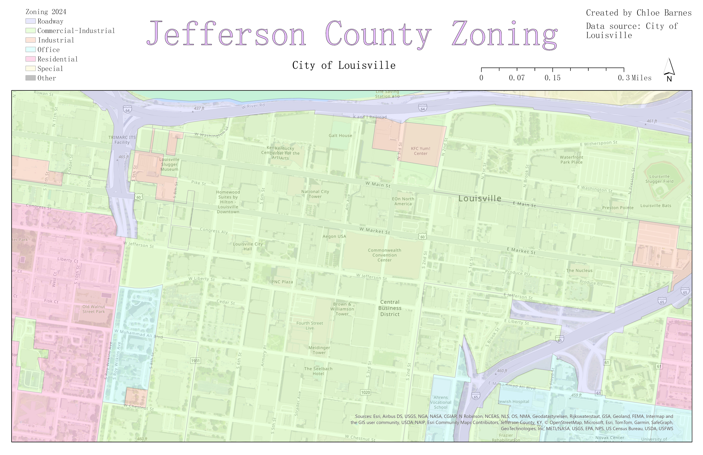

# Louisville-Solar-Exposure
This map collection is part of my capstone project submission for GEO499 during the spring semester of 2024 at the University of Kentucky. This map is a case study to help visualize an example of my research regarding solar mapping and the installation process of solar panels.

## Relative Sunlight Exposure in Louisville, KY

This map can be utilized for knowing exactly where solar panels would be best optimized for most overall energy poroduction in downtown Louisville.

## Reference Map

This map was created to provide a reference to the map above, and it is the same snapshot as the solar map above to visualize which streets, types of development/land use, as well as what types of buildings are shown. As we can see, there is mostly commercial land use in the map, which conicides with the fact that the snapshot is of downtown Louisivlle. It is there in order to visualize which buildings and spots receive the most sunlight.

